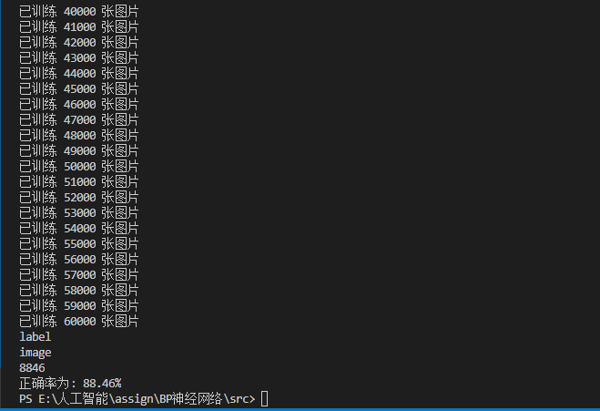

# BP神经网络

## 网络结构

本BP算法采用三层神经网络，其中输入层`784`个，隐层`38`个，输出层`10`个，采用`sigmoid`函数作为激励函数。学习步长 $\eta$ 为 `0.1` 

## BP神经网络算法

1. 初始设定

   初始权值矩阵(2个)由下述函数生成:

   ```python
   def weightGenerator(self, weight, row, column):
       temp = 4.8 / row
       for i in range(row):
           for j in range(column):
               weight[i].append((random.random() - 0.5) * temp)
   ```

   这个函数用于生成分布在区间$(−2.4/F,2.4/F)$ 之间的随机初始值。$F$为所连单元的输入端个数。

2. 定义激励函数

   ```python
   def f(self, a, b):
       return 1/(1+np.exp(-1 * a @ b))
   ```

3. 设计输出

   ```python
   pixes = np.array([struct.unpack(formatStr, file.read(inputLayerNodeNum))])
   //Ioutput 输入层输出矩阵 1 * 748
   Ioutput = 1 / (1 + np.exp(-1 * pixes))
   //Houtput 隐层输出矩阵 1 * 38
   Houtput = self.f(Ioutput, self.weightIH)
   //Ooutput 输出层输出矩阵 1 * 10
   Ooutput = self.f(Houtput, self.weightHO)
   ```

4. 错误反馈

   1. 书本上:
      $$\delta_o^O(n) = y_o(n)(1-y_o(n))(d_o(n) - y_o(n)) \quad o= 1, 2, \dots, O$$
      $$\delta_h^H(n) = f'(u_h^H(n))\sum_{h=1}^H\delta_o^O(n)w_{ho}(n) \quad h= 1, 2, \dots, H$$

      这里的 $f'(u_h^H(n))$ 经计算后，实际上可以写成$v_h^H(n)* (1 - v_h^H(n))$ (在激励函数为sigmoid的情况下)。用`EO`表示由$\delta_o^O(n),  o= 1, 2, \dots, O$ 组成的$1*O$的矩阵，那么

      ```python
      // 计算输出层的误差, EO为 1 * 10 的矩阵, Ooutput 1 * 10 的矩阵
      EO = Ooutput * (1 - Ooutput) * (self.d(labels[count]) - Ooutput)
      ```

      那么实际上$\sum_{h=1}^H\delta_o^O(n)w_{ho}(n), h= 1, 2, \dots, H $ 可以表示为`(self.weightHO @ EO.T).T` 所以用`EH`表示$\delta_h^H(n),  h= 1, 2, \dots, H$ 那么

      ```python
      // 计算隐层的输出误差, EH为 1 * 38 的矩阵, Houtput为 1 * 38 的矩阵
      EH = Houtput * (1 - Houtput) * (self.weightHO @ EO.T).T
      ```

   2. 按下式计算权值修正值$\Delta w$,并修正权值; $n = n + 1$, 转至第4步:
      $$\Delta w_{ho}(n) = \eta\delta_o^O(n)v_h^H \quad w_{ho}(n+1) = w_{ho}(n) + \Delta w_{ho}(n)$$
      $$\Delta w_{ih}(n) = \eta\delta_h^H(n)v_i^I \quad w_{ih}(n+1) = w_{ih}(n) + \Delta w_{ih}(n)$$

      转换成`python`代码为

      ```python
      // 计算新的隐层与输出层的权值矩阵, Houtput.T 为 38 * 1 的矩阵
      // 这里实际上是使用线性代数的Ax=B，求x。x=A.T @ B。
      self.weightHO = self.weightHO + yita * Houtput.T @ EO
      // 计算新的输入层与隐层的权值矩阵, Ioutput.T 为 784 * 1 的矩阵
      self.weightIH = self.weightIH + yita * Ioutput.T @ EH
      ```

5. 预测

   ```python
   count, countTrue = 0, 0
   while count < numOfImages:
       pixes = np.array([struct.unpack(formatStr, file.read(inputNode))])
       Ioutput = 1 / (1 + np.exp(-1 * pixes))
       Houtput = self.f(Ioutput, self.weightIH)
       Ooutput = self.f(Houtput, self.weightHO)
       // labels中存储的是该图像代表的数字，np.argmax(Ooutput)为预测的数字
       if labels[count] == np.argmax(Ooutput):
           countTrue = countTrue + 1
       count = count + 1
   print(countTrue)
   print("正确率为: " + str(countTrue * 100.0 / numOfImages) + "%")
   ```

## 结果

