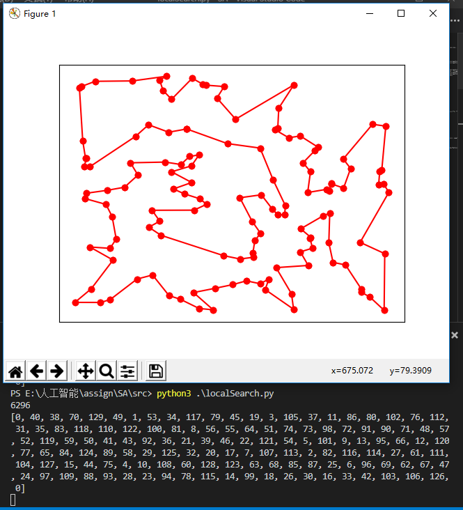
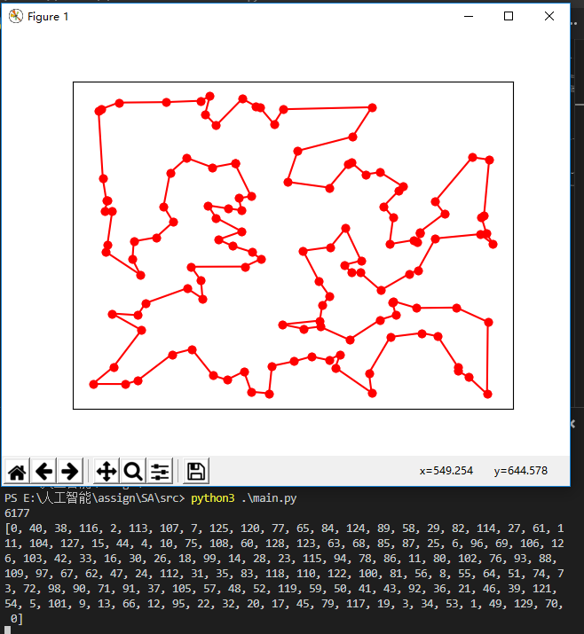

# 模拟退火算法

## 初始路径生成

直接将各城市依次连接起来，形成一个环。

##采用多种邻域操作的局部搜索local search策略求解

1. 局部搜索策略

   ```python
   // 局部搜索的扰乱函数，随机选取一个下标，将从这一点开始的数移动到下标为1处。
   def disturbance(path):
       size = len(path)
       ran = random.randint(2, size - 1)
       path[1:size - ran], path[size - ran:size - 1] = path[ran:size - 1], path[1:ran]
   def localSearch(dis, path, count):
       disturbance(path)  //扰乱
       size = len(path) - 1
       length = 0
       // 计算扰乱之后的路径长度
       for i in range(size):
           length = length + dis[path[i]][path[i + 1]]
       // 局部搜索
       for i in range(1, size - 1):
           for j in range(i + 1, size):
               // 策略一: 倒置 [i, j] 这一个区间, dis记录了各点间的距离
               tempDE = dis[path[i - 1]][path[j]] + dis[path[i]][path[j + 1]] -\
                        dis[path[i - 1]][path[i]] - dis[path[j]][path[j + 1]]
               if tempDE < 0:
                   length = length + tempDE
                   path[i:j+1] = path[j:i-1:-1]
               // 策略二: 将第i个和区间中点位置交换。
               k = int((i + j) / 2 + 0.5)
               tempDE = dis[path[i - 1]][path[k]] + dis[path[k]][path[i + 1]] +\
                        dis[path[i]][path[k + 1]] + dis[path[k - 1]][path[i]] -\
                        dis[path[i - 1]][path[i]] - dis[path[i]][path[i + 1]] -\
                        dis[path[k - 1]][path[k]] - dis[path[k]][path[k + 1]] +\
                        (k == i + 1) * 2 * dis[path[i]][path[k]]
               // tempDE 描述了整个过程的优化结果。。小于0表示新路径更优。
               if tempDE < 0:
                   length = length + tempDE
                   path[i], path[k] = path[k], path[i]
       return length
   ```


2. 迭代搜索

   ```python
   // 迭代搜索，由max_iterations指定迭代次数。在这里max_iterations = 50
   while count < max_iterations:
       length = localSearch(dis, path, count)
       if length < bestPathLength:
           bestPathLength = length
           bestPath = path[:]
   ```


3. 效果: 实验结果为`6292`， 在`10%` 以内。

   

## 模拟退火simulated annealing策略

初温为$1000.0^\circ C$, 退火系数`0.98`，内循环次数`节点平方的一半(目的是为了使得策略中每个方案都能被选到一次，当然这是个概率问题)`,为了防止时间太长，最大为`10000`。

```python
    t, a, MapkobChainLength= 1000.0, 0.98, int(len(x) * len(x) / 2)
    dE, count, lastLength = 0, 0, 0
    if MapkobChainLength > 10000:
        MapkobChainLength = 10000
    while t > 0.01 and count < 20:
        for k in range(MapkobChainLength):
            i = random.randint(1, len(x) - 2)
            j = random.randint(i + 1, len(x) - 1)
            dE = dis[path[i - 1]][path[j]] + dis[path[i]][path[j + 1]] -\
                 dis[path[i - 1]][path[i]] - dis[path[j]][path[j + 1]]
            if dE <= 0 or random.random() < math.exp(-dE / t):
                path[i:j+1] = path[j:i-1:-1]
                length = length + dE
        if length == lastLength:
            count = count + 1
        else :
            lastLength = length
            count = 0
```

效果: 本次测试结果为`6177(1.10%)`，参考最佳结果为`6110`。大多数情况下，模拟退火都能在`6400(4.74%)`以内。最好情况下达到过最优解`6110`。



## 结论

根据多次观察

1. 从结果来说：
   1. 局部搜索算法的解都在$[6200, 6600]$区间之内。大部分情况下位于$[6200, 6400]$区间。
   2. 模拟退火算法的解基本上都在$[6110, 6300]$之间。极少情况下会在$[6300, 6400]$之间。
2. 从时间来说：
   1. 迭代局部搜索算法时间复杂度为$O(n^2)$, $C$值为迭代次数
   2. 模拟退火算法的时间负杂度为$O(n^2)$, $C$ 值于退火系数和内循环次数有关

综合两者，模拟退火算法的解优于迭代局部搜索算法，且更稳定，但是速度在这个案例上相对较慢（当然，数据更大时，模拟退火会更快）。模拟退火的解比局部搜索的解更稳定。